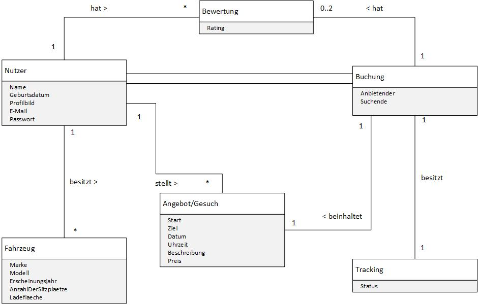

# Mycargonaut

## Umgesetzte Features
- Registrierung von „Cargonauten“
  (Nutzern)
- Profilansicht
- Fahrzeugverwaltung
- Angebot/Gesuch erstellen
- Tracking
- Bewertung nach Abschluss der Fahrt
 

## Infrastruktur
- GitHub
- Travis-CI
- Hound-CI
- GitHub-Pages
- TypeScript
- Angular
- Bootstrap
- Jasmine and Karma for Tests
- Figma for Mockups and Wireframes
- Trello for Scrum Board

## WireFrames und Mockups
Die Wireframs und Mockups wurden mit Figma erstellt. [Link zu den Wireframes und Mockups](https://www.figma.com/file/POBCVCE3S3cPGvloxHIiwK/MyCargonaut?node-id=0%3A1)

## UML Diagramme 

### Domänenmodell

### UML-Diagramm

## Teststrategie
Bei jedem Push und Pull-Request wird die CI-Pipeline mittels Travis-CI gestartet und die Tests durchgeführt. 
Sollten Tests fehlschlagen kann ein Pull-Request in einen Branch nicht ausgeführt werden. Die Entwickler:innen müssen zunächst die Bugs beheben.
Wenn ein Push in den Main-Branch gemacht wird es nach erfolgreicher CI-Pipeline ein Deployment zu den [GitHub-Pages](https://kms-mycargonaut.github.io/mycargonaut/) geben.

## Information for Development
This project was generated with [Angular CLI](https://github.com/angular/angular-cli) version 11.2.12.

## Development server

Run `ng serve` for a dev server. Navigate to `http://localhost:4200/`. The app will automatically reload if you change any of the source files.

## Code scaffolding

Run `ng generate component component-name` to generate a new component. You can also use `ng generate directive|pipe|service|class|guard|interface|enum|module`.

## Build

Run `ng build` to build the project. The build artifacts will be stored in the `dist/` directory. Use the `--prod` flag for a production build.

## Running unit tests

Run `ng test` to execute the unit tests via [Karma](https://karma-runner.github.io).

## Running end-to-end tests

Run `ng e2e` to execute the end-to-end tests via [Protractor](http://www.protractortest.org/).

## Further help

To get more help on the Angular CLI use `ng help` or go check out the [Angular CLI Overview and Command Reference](https://angular.io/cli) page.
